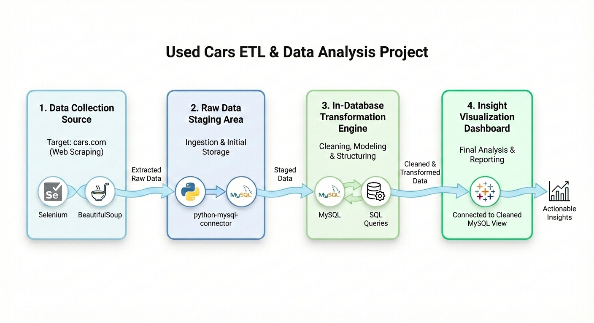
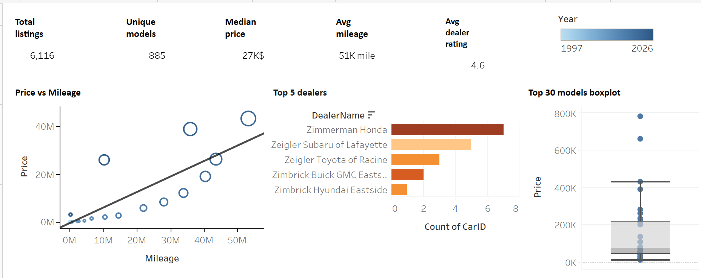

# Used Cars ETL Pipeline & Market Analysis

An automated end-to-end data pipeline that extracts real-time used car listings, processes them through a SQL database, and delivers actionable market insights via Tableau.

📌 Project Overview

* This project demonstrates a full ETL (Extract, Transform, Load) cycle:
* Extraction: Web scraping dynamic data from cars.com.
* Staging: Automating data ingestion into a relational database.
* Transformation: Cleaning and modeling data using advanced SQL.
* Visualization: Creating an interactive dashboard.

🛠️ Tech Stack

* Language: Python
* Scraping: Selenium & BeautifulSoup
* Database: MySQL (mysql-connector-python)
* Data Wrangling: SQL
* Business Intelligence: Tableau

🚀 The Pipeline

* Data Collection: Custom scraper to bypass dynamic content and extract car features (Model, Price, Mileage, year, etc.).
* Database Setup: Python scripts to create the schema.
* Wrangling: SQL scripts to handle missing values, format currency, and duplicates.
* Dashboard: Live connection between MySQL and Tableau to visualize market distribution.

📊📈 Dashboard

